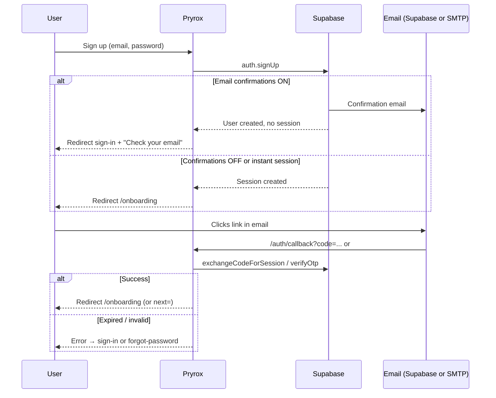

# Auth email verification & delivery

What happens today when users confirm their account, when links expire, or when email is not delivered — and what we should improve later.

**Roadmap:** [future-features.md](./future-features.md) (unified templates, resend confirmation).

---

## Flow overview



---

## Sign-up (`signUpAction`)

**Code:** `src/app/actions.ts` → `sendSignupConfirmationEmail` in `src/lib/email/auth-emails.ts`.

| Outcome | What happens | What the user sees |
|---------|----------------|-------------------|
| **Success, email sent (Supabase)** | User row created; `email_confirmed_at` null until link used | Redirect to `/sign-in` with success: *"Check your email to confirm your account, then sign in."* |
| **Success, session immediately** | Supabase returned a session (e.g. confirm email disabled in project) | Redirect straight to `/onboarding` |
| **Supabase rate limit** | Fallback: `generateLink` + Nodemailer with `confirmationEmailHtml` | Same sign-in message; may note backup SMTP in message |
| **Rate limit + no SMTP** | `ok: false` | Redirect to `/sign-up` with error about rate limit / configure SMTP |
| **Other error** (duplicate email, weak password, etc.) | `ok: false` | Redirect to `/sign-up` with Supabase error message |

**Redirect target in email:** `emailRedirectTo` → `/auth/callback?next=/onboarding` (via `callbackUrl`).

---

## Expired or invalid confirmation link

Supabase typically redirects with **hash** parameters (client-only), for example:

```text
/onboarding#error=access_denied&error_code=otp_expired&error_description=Email+link+is+invalid+or+has+expired
```

Or the user may land on `/sign-in` with query `?error=...` after `/auth/callback` fails.

### Handler: `AuthHashHandler`

**Code:** `src/components/auth/auth-hash-handler.tsx`  
**Mounted on:** `/onboarding`, and on `/sign-in` / `/sign-up` via `AuthIntentShell`.

| Step | Behavior |
|------|----------|
| Reads `window.location.hash` | Server never sees `#...` |
| `error_code === otp_expired` | Toast: *"This confirmation link has expired. Sign in with your email and password, or sign up again to receive a new link."* |
| Other errors | Toast with `error_description` or generic message |
| Then | Clears hash, `router.replace("/sign-in")` |

### Handler: `/auth/callback` (query `code` / `token_hash`)

**Code:** `src/app/auth/callback/route.ts`

| Failure | Redirect | Message |
|---------|----------|---------|
| Invalid/expired OTP (signup) | `/sign-in?error=...` | Supabase error text (via `AuthSearchParamsToast` on sign-in) |
| Invalid recovery link | `/forgot-password?error=...` | Suggests new reset link / same browser |

**Gap:** If Supabase sends users to `/auth/callback` with a **hash** error instead of query params, `AuthHashHandler` is **not** on that route — only on auth pages and onboarding. Prefer configuring Supabase redirect URLs to land on `/sign-in` or `/onboarding` where the handler exists.

---

## User did not receive the email

Possible causes and **current** Pryrox behavior:

| Reason | System behavior | User experience today |
|--------|-----------------|------------------------|
| **Spam / promotions folder** | No detection | Stuck on “check your email”; no in-app guidance beyond sign-in success text |
| **Wrong email typed** | Account exists under typo | Resend not available; sign-up again may say user already exists |
| **Supabase free-tier rate limit** | Fallback to Nodemailer if `SMTP_*` set | Works if SMTP configured; otherwise sign-up error |
| **SMTP not configured** | Fallback fails | Error on sign-up with message to add SMTP or wait |
| **Supabase Auth SMTP / domain not set** | Supabase may not deliver reliably | Silent failure from user’s perspective |
| **Link expired before open** | `otp_expired` on click | Toast + redirect sign-in (see above) |
| **Email confirmations disabled** in Supabase | Immediate session | User may reach `/onboarding` without ever seeing email — OK |

**There is no “Resend confirmation email” action** in the app today.

### What the user can do manually today

1. Wait and check spam — then use the link within Supabase’s link lifetime (project setting, often ~24h).
2. Try **Sign in** — if already confirmed, onboarding loads; if not, Supabase may return *Email not confirmed* (generic error from `signInAction`).
3. Try **Sign up again** with same email — usually fails with “already registered”.
4. Contact support — admin could confirm email in Supabase dashboard (`email_confirm: true`) or delete user and re-register.

---

## Sign-in before email is confirmed

**Code:** `signInAction` → `signInWithPassword`.

If Supabase requires confirmed email and the user is unconfirmed:

- Sign-in fails with Supabase message (often *"Email not confirmed"*).
- User is redirected to `/sign-in?error=...` (`AuthSearchParamsToast` shows toast).

**Gap:** No dedicated CTA to resend confirmation on that error.

---

## Onboarding without a valid session

`/onboarding` is a **protected** route (`lib/middleware/auth-routes.ts`).

| Situation | Behavior |
|-----------|----------|
| No session | Middleware redirects to `/sign-in` |
| Session but `GET /api/onboarding/status` → 401 | Onboarding form redirects to `/sign-in` |
| Expired link hash on `/onboarding` | `AuthHashHandler` → toast + `/sign-in` (user never gets a session) |

So the confusing case from support — *“I clicked confirm and see Unauthorized on onboarding”* — is usually: **link failed (expired)** → hash error handler sends to sign-in; or user bookmarked `/onboarding` without logging in.

---

## Password reset (related)

**Code:** `forgotPasswordAction` → `sendPasswordRecoveryEmail`.

| Path | Behavior |
|------|----------|
| Supabase sends reset | User gets email; link → `/reset-password` via `recoveryRedirectUrl` |
| Rate limit | Nodemailer + `recoveryEmailHtml` |
| Expired reset link | `/auth/callback` or hash → `/forgot-password` with error |

Staff invites use a **separate** pipeline (`lib/email/staff-invite.ts`) — not Supabase confirmation; includes temporary password in email.

---

## Configuration checklist (ops)

| Setting | Where | Impact |
|---------|--------|--------|
| **Confirm email** on/off | Supabase → Authentication → Providers → Email | If off, no confirmation email; instant session |
| **Site URL / Redirect URLs** | Supabase → Authentication → URL configuration | Must include `{APP_URL}/auth/callback` and `{APP_URL}/auth/confirm` |
| **Email templates** | Supabase dashboard | Only used when Pryrox sends via Supabase Auth (not fallback HTML) |
| **Custom SMTP** | Supabase and/or `.env` `SMTP_*` | Fallback path in `auth-emails.ts` |
| **`NEXT_PUBLIC_APP_URL`** | `.env` | Must match link host in emails |

---

## Implemented product changes

| Feature | Implementation |
|---------|----------------|
| Resend confirmation | `POST /api/auth/resend-confirmation` (3 / 15 min per email+IP) |
| Post-sign-up holding page | `/verify-email?email=…` |
| Confirm link landing | `/auth/confirm?next=/onboarding` (hash, `token_hash`, forwards `code`) |
| Email not confirmed | Sign-in → `?unconfirmed=1&email=…` + `EmailNotConfirmedAlert` |
| Expired link | `AuthHashHandler` → `/verify-email?expired=1` |

**Still planned:** unified email templates — [future-features.md](./future-features.md).

---

## Key files

| File | Role |
|------|------|
| `src/lib/email/auth-emails.ts` | Sign-up + reset send logic |
| `src/lib/email/resend-confirmation.ts` | Resend confirmation email |
| `src/app/api/auth/resend-confirmation/route.ts` | Resend API |
| `src/app/(auth)/verify-email/page.tsx` | Post-sign-up “check your email” |
| `src/app/auth/confirm/page.tsx` | Email link landing + hash errors |
| `src/app/auth/callback/route.ts` | Exchange PKCE `code` |
| `src/components/auth/auth-hash-handler.tsx` | Hash errors on auth pages |
| `src/components/auth/email-not-confirmed-alert.tsx` | Sign-in resend UX |
