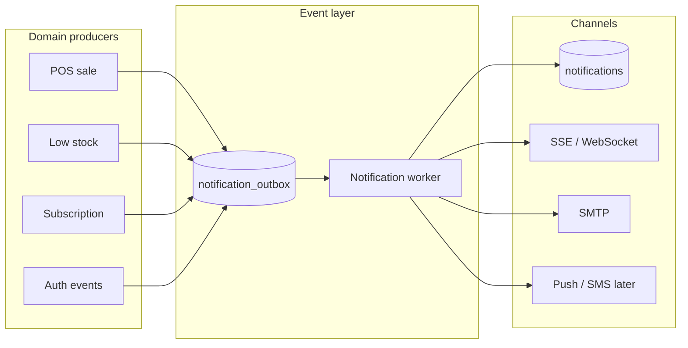

# Future features

Planned work that is **not implemented yet** or only exists as **mock / placeholder / UI-only** behavior.

**Strategy:** **Prisma migration is complete** (May 2026). Implement items below as real features on top of `lib/db/*`. SQL schema history stays in `supabase/migrations/` (`npm run db:sql:push`).

**Related:**

- [Prisma migration status](#prisma-migration-roadmap) (below)
- [Mocks & placeholders catalog](#mocks-placeholders--hardcoded-catalog) (below)
- [feature-status.md](./feature-status.md) — detailed shipped/broken assessment
- [ebm-integration-decision-brief.md](./ebm-integration-decision-brief.md) — RRA EBM vendor decision
- [auth-email-verification.md](./auth-email-verification.md) — email delivery

When a feature ships, move it to `docs/modules/` or `docs/feature-status.md` and remove or shorten it here.

---

## Confirmed by code audit (June 2026)

The current remaining backlog is based on route/helper/UI inspection, not only older notes in this doc.

| Phase | Confirmed remaining work |
|-------|--------------------------|
| 2 | Generic uploads/exports should stay real file-backed; `/api/rra/invoice` is deprecated in favor of `/api/integrations/rra-ebm` |
| 3 | Pharmacy settings compliance panel is informational/deferred |
| 4 | POS features complete |
| 5 | Accounting expense ledger now uses sales, purchase orders, payments, invoices, manual expenses, and salary estimates; RRA/EBM tax submission is deferred |
| 6 | Production KPay/Polar credential hardening; EBM hardening deferred |
| 7 | Certified clinical safety dataset implemented |
| 8 | Field-encryption product requirements and optional notification scale-out remain |

Shipped and no longer backlog: Prisma/native auth, `pg_dump` backups, data retention cron, notification prefs/dispatch/SSE, pharmacy currency/language persistence, audit-log toggle enforcement, admin alert email routing, stock-location templates, dynamic admin system status, VSDC-backed RRA/EBM adapter, Mobile Money simulated provider integration, settings panels (analytics scheduling + supplier/SMS sync), certified clinical safety rules dataset, DB-backed email template editor, broader admin search, and notification mark-read.

**RRA/EBM hold:** Do not build deeper RRA/EBM flows until vendor/API requirements are complete. Accounting and financial reports expose extension metadata (`fiscalSubmission: deferred_rra_ebm`) instead of guessing fiscal receipt behavior.

---

## Prisma migration roadmap

**Goal:** `DATABASE_URL` → Prisma for all app data access; **remove Supabase client and GoTrue**; native auth + VPS Postgres.

### Done (Prisma + `lib/db/*` — no Supabase JS client in `src/`)

| Module | Routes / libs |
|--------|----------------|
| IP whitelist | Policy, manage APIs, auto-add on enable |
| Inventory | Full slice: `inventory/*`, `stock-alerts`, suppliers, transfers list, analytics |
| POS | Products, sale, returns, shifts, void/hold/price-check, customer-lookup, daily-close, invoice, quick-add-* |
| Reports | `reports/sales`, `reports/inventory`, `reports/insurance-claims`, pharmacy charts, dashboard |
| Customers | `customers`, `customers/[id]` (+ loyalty stub remains) |
| Insurance | `insurance/*`, covered-medications, POS claims, monthly report |
| Notifications | Outbox, SSE, bell, prefs, dispatch worker (Step 16) |
| Session context | `/api/me/context`, `active-pharmacy`, `active-branch` (no session `createClient`) |
| Subscriptions & billing | Entitlements, orchestrator, KPay/Polar, invoices (see steps 1–6b) |

**Schema:** Full introspect in `prisma/schema.prisma` (84 models, `public` + `auth`).

### Post-migration backlog (product & ops)

Migration complete. Remaining work is **features and enforcement**, not data-layer ports:

| Priority | Area | Notes |
|----------|------|--------|
| 1 | **Quick fixes** | ~~Sales item counts, report date filters, expiry-alerts, admin pharmacies auth~~ **Done (Jun 2026)** |
| 2 | **Settings enforcement** | **Done for current settings** — unsupported fake toggles removed; audit/logging/backups/retention/notifications enforced |
| 3 | **Integrations** | RRA EBM VSDC adapter shipped (needs live `RRA_VSDC_BASE_URL` + vendor creds); mobile money remains |
| 4 | **Stubs** | Loyalty auto-award on POS sale **Done** |
| 5 | **13b** | **Done** — v1 APIs, webhooks, Redis rate limit (`REDIS_URL`), admin scope UI |

**Storage:** Logos use Cloudinary or local disk (`uploadAndPersistPharmacyLogo`), not Supabase Storage.

**Pattern:** `lib/db/<domain>-store.ts` → Prisma only.

### Subscription migration steps

Migrate in order — each step is read-only or isolated before touching the orchestrator write path.

| Step | Scope | Status |
|------|--------|--------|
| 1a | Pharmacy usage counts (`pharmacy-usage-store`) → `plan-limits` | Done |
| 1b | `GET /api/subscriptions/status` — active sub + recent payments | Done |
| 2 | `resolvePharmacyEntitlements` read path (plan limits, feature gates, `/api/entitlements`) | Done |
| 3 | Scheduled change read, `branchHasAddonSubscription`, branch-addon plan lookup | Done |
| 4 | Plan catalog reads (`GET /api/plans`, `resolveCatalogPlan`) | Done |
| 5a | POST plan lookups + main sub reads (`getMainSubscriptionRow`) | Done |
| 5b | Paid/free upgrade writes (`beginPaidPlanChange`, `activateFreePlan`) | Done |
| 5c | Schedule downgrade, branch-addon writes, payment activation | Done |
| 6a | Cancel/expire cron, pharmacy projection cache, link tx → subscription | Done |
| 6b | KPay/Polar checkout + webhooks, `recordSubscriptionPayment`, invoices | Done |
| 7 | Customers & staff (`/api/customers/*`, `/api/staff/*` — native `admin-users`) | Done |
| 8 | Reports & dashboard (`/api/reports/sales`, `/api/reports/inventory`, `/api/pharmacy/dashboard`, `/api/dashboard`, pharmacy chart routes) | Done |
| 9 | Insurance (`/api/insurance/*`, claim lines, monthly report, POS sale claims) | Done |
| 10a | Admin platform (`categories`, `api-keys`, `features`, `insurance-templates`, `system-settings`, `search`, `transactions`, `backups`, `ip-whitelist`) | Done |
| 10b | Admin platform tail (`pharmacies` CRUD, `plans` admin, `reports` metadata, `pharmacy-detail`, plan feature sync) | Done |
| 11a | `pharmacy-users-store` + `public-users-store` (memberships, profile, 2FA, active context) | Done |
| 11b | `two-factor-sessions-store`, tail server reads, client components via `/api/me/context` | Done |
| 12a | Native auth foundation (`app_sessions`, JWT cookie, sign-in/sign-out/2FA, middleware, `getAuthUser`, `admin-users`) | Done |
| 12b | Bulk `getAuthUser()` on API routes + admin/staff password paths + change-password native | Done |
| 13a | Rate limiting — `rate_limit_buckets`, platform API middleware, auth/2FA, persist `apiRateLimit` | Done |
| 13b | Platform integration API keys for external developers, Redis option, dashboard usage metrics | **Done** (usage metrics UI optional tail) |
| 14 | Platform & pharmacy **settings enforcement** — wire saved toggles/limits to runtime (see audit below) | **Done for current settings**; future-only items moved out of editable settings |
| 15 | **System-wide audit** — working vs partial vs stub (see [Step 15](#step-15--system-wide-audit)) | Living doc |
| 16 | **Event-driven notifications** — in-app live + email (+ push later); see [Step 16](#step-16--event-driven-notifications) | **Done** (16a–c); tail events optional |

> **Note:** [feature-status.md](./feature-status.md) is a 2025 static snapshot. Several items there are **fixed** (sign-up, forgot-password, native auth, rate limits, IP whitelist, POS returns, Prisma stores). Use **Step 15** below as the current backlog index; update it when shipping fixes.

### Step 12 — Native auth (Supabase removal)

**Goal:** Pryrox-native sessions only — no Supabase GoTrue, no OAuth/email fallbacks.

**Env:**

```env
DATABASE_URL=postgresql://...
NATIVE_AUTH_ENABLED=true
AUTH_SECRET=<min 32 chars>
GOOGLE_CLIENT_ID=...          # optional Google sign-in
GOOGLE_CLIENT_SECRET=...
```

**Done:**

| Piece | Location |
|-------|----------|
| Sessions + JWT | `lib/auth/native/session*.ts`, `app_sessions` |
| Sign-in / sign-out / 2FA | `app/actions.ts`, `api/auth/complete-2fa`, middleware |
| Sign-up, confirm, reset | Native SMTP tokens (`native-auth-emails`, `auth-tokens`) |
| Google OAuth | `/api/auth/google` → `lib/db/oauth-google.ts` (no Supabase branch) |
| Admin user CRUD | `admin-users.ts` → Prisma `auth.users` |
| Staff auth lookups | `staff-store`, `staff-invite-email` via `adminGetAuthUserById` |

**Done (2026):** Supabase JS clients removed from `src/`. SQL migrations remain under `supabase/migrations/` for schema history only.

**Store fallbacks removed (May 2026):** pharmacy-tenant stores + `admin-store`, `subscriptions-store`, `subscription-writes-store`, `billing-store`, `cashier-shifts-store`, `staff-store`, `ip-whitelist-store`, `plan-features-store`, `payment-transactions-store`, `change-events-store`, `two-factor-sessions-store`, `pharmacy-usage-store`.

### Step 13 — Rate limiting (post-Supabase)

**Why:** Supabase GoTrue provided built-in limits on `signInWithPassword` and email sends. Native auth + Prisma removes that layer.

**Done (13a):** `rate_limit_buckets` table, `lib/rate-limit/*`, platform `/api/*` cap in middleware (reads `apiRateLimit` from `system_settings`), sign-in + 2FA + resend-confirmation limits, cache invalidation on admin save.

**Target (13b):**

| Layer | Scope | Implementation notes |
|-------|--------|----------------------|
| **Auth** | Sign-in, native password verify, forgot-password, reset | Per-IP + per-email sliding window; lockout or exponential backoff |
| **2FA** | `POST /api/auth/verify-2fa`, `POST /api/auth/complete-2fa` | Strict limits — service-role reads `two_factor_sessions`; prevent token enumeration |
| **Platform API** | All `/api/*` (or per-route tiers) | Read `apiRateLimit` from platform settings; enforce in middleware or shared `requireRateLimit()` |
| **Platform integration API keys** | External developers calling Pryrox (`api_keys` where `pharmacy_id IS NULL`) | Per-key rate limit; auth via `Authorization: Bearer` or `X-Pryrox-Api-Key`; v1 read APIs at `/api/integrations/v1/*` |
| **Storage** | VPS / multi-instance | Postgres `rate_limit_buckets` or Redis; replace in-memory `Map` (resend-confirmation resets on deploy) |

**Admin UI:** Persist `apiRateLimit` via `PUT /api/admin/system-settings` (same blob as `allowUserTwoFactor`, `ipWhitelistEnabled`). Show current usage in superadmin dashboard when enforcement ships.

**Related:** [feature-status.md](./feature-status.md) (auth rate limiting marked incomplete), [authentication.md](./modules/authentication.md) §5.

### Step 14 — Settings enforcement audit

**Goal:** Every control in **Admin → Settings** and **Pharmacy → Settings** either works at runtime or is clearly marked placeholder. Today many fields are **saved to `system_settings` but never read** by API routes, middleware, or sign-up flows.

**Persistence:** Admin platform blob → `PUT /api/admin/system-settings` → `system_settings` rows (`pharmacy_id` null). Pharmacy profile → `PUT /api/pharmacy/settings` (partial). Per-tenant security → `security_settings` + dedicated routes.

#### Admin platform settings (`AdminPlatformSettings`)

| Setting | Saved | Enforced | Notes |
|---------|-------|----------|-------|
| `platformName` | Yes | **Display** | `GET /api/branding`, auth/sidebar via `useBranding()` |
| `platformLogoUrl` | Yes | **Display** | Same |
| `supportEmail` | Yes | **Display** | `usePlatformSupport()` mailto links on blocked-access screens |
| `adminEmail` | Yes | **Yes** | Platform notification outbox rows without `user_id` email this address |
| `maxPharmacies` | Yes | **Yes** | `assertCanCreatePharmacy()` on onboarding + admin create |
| `maxUsersPerPharmacy` | Yes | **Yes** | Entitlement `maxUsers` = `min(plan.max_users, platform maxUsersPerPharmacy)` |
| `apiRateLimit` | Yes | **Yes** | Middleware `enforcePlatformApiRateLimit` → `getPlatformApiRateLimit()` |
| `allowUserTwoFactor` | Yes | **Yes** | Sign-in 2FA gate, `GET/POST /api/settings/security/2fa`, settings UI hide |
| `ipWhitelistEnabled` | Yes | **Yes** | `getPlatformIpWhitelistPolicy()` + middleware IP check for admin scope |
| `enableRegistrations` | Yes | **Yes** | `signUpAction` + middleware blocks `/sign-up` |
| `maintenanceMode` | Yes | **Yes** | Middleware → `/maintenance` (503 on API); platform admins bypass |
| `enableNotifications` | Yes | **Yes** | `emitNotificationEvent` + dispatch worker respect flag |
| `backupEnabled` | Yes | **Yes** | `POST /api/admin/backups` returns 403 when disabled |
| `autoUpdates` | No | **N/A** | Removed from editable settings/API allowlist; deployment updates are shown as platform-managed |
| `enableWhiteLabel` | Yes | **Yes** | Branding PUT requires platform flag + plan `customization` |
| `enableMultiBranch` | Yes | **Yes** | `POST /api/branches` checks platform flag before entitlements |
| `dataRetentionDays` | Yes | **Yes** | `/api/cron/data-retention` purges old audit logs + webhook deliveries |
| `enableAuditLogs` | Yes | **Yes** | Activity/audit reads return 403 when disabled; central writer covers settings/security/templates, POS sales/voids, inventory, staff, core admin catalog, subscription changes, and auth security events |
| `encryptionEnabled` | No | **N/A** | Removed from editable settings/API allowlist; database/hosting encryption is informational, field-level encryption is future product work |

#### Admin settings — adjacent UI (not only the blob)

| Feature | Saved | Enforced | Notes |
|---------|-------|----------|-------|
| Platform API keys | Yes (`api_keys`, `pharmacy_id IS NULL`) | **Yes (read APIs)** | CRUD in Admin → Integrations; v1 pharmacies/inventory/sales; outbound vendor creds (RRA, MoMo) by key name |
| Platform IP allowlist entries | Yes | **Yes** | When `ipWhitelistEnabled` on |
| Platform admin 2FA | Yes (user row) | **Yes** | User-level, not `system_settings` |
| Stock location templates | Yes (`system_settings.stockLocationTemplates`) | **Yes** | Admin CRUD; active templates auto-copy to new pharmacies during onboarding |
| System load | — | **Yes** | Admin settings reads OS memory stats from `/api/admin/system-settings` |
| Payment gateway health chip | — | **Yes** | Reports configured/not configured from Polar/KPay env presence |
| Insurance health chip | — | **Yes** | Reports healthy/review/not configured from active insurance providers and templates |

#### Pharmacy settings (`/pharmacy/.../settings`)

| Panel / control | Saved | Enforced | Notes |
|-----------------|-------|----------|-------|
| General — name, phone, email, location | Yes | **Yes** | `PUT /api/pharmacy/settings` |
| General — currency, language | Yes | **Yes** | Persisted via `pharmacy_settings` locale helpers |
| Security — change password | Yes | **Yes** | Native + Supabase paths |
| Security — 2FA | Yes | **Yes** | Respects platform `allowUserTwoFactor` |
| Security — IP whitelist | Yes | **Yes** | Per-pharmacy `security_settings` + middleware |
| Security — encryption badge | — | **Informational** | Shows platform-managed encryption; not an app-controlled setting |
| Security — session timeout | — | **Informational** | Session lifetime is controlled by platform session policy |
| Operations — stock locations | Yes | **Yes** | `GET/POST /api/settings/locations` (fallback defaults if table missing) |
| Operations — maintenance / auto-updates | — | **Informational** | Badges show these are platform/deployment managed |
| Notifications — prefs | Yes | **Yes** | Saved via `/api/notifications/preferences`; push/SMS delivery simulated |
| Compliance — GDPR, audit, retention, backups | — | **Informational** | Badges/disabled selects point to platform-managed policy |
| Analytics — report scheduling | Yes | **Yes** | Scheduled report preferences saved to `/api/settings/report-schedules` |
| Integrations — supplier / SMS | Yes | **Yes** | Configured and saved to `/api/settings/integrations` |
| Branding — logo, colors, domain | Yes | **Yes** | Gated by plan feature `customization` (not `enableWhiteLabel`) |

#### Implementation order (recommended)

| Phase | Scope |
|-------|--------|
| **14a** | `maxPharmacies`, `enableRegistrations`, `maintenanceMode` (highest user-visible impact) |
| **14b** | `maxUsersPerPharmacy`, `enableMultiBranch`, `enableWhiteLabel` (align with entitlements) |
| **14c** | Pharmacy currency/language + notification prefs | **Done** — `pharmacy_settings` locale + `/api/notifications/preferences` |
| **14d** | `dataRetentionDays`, `enableAuditLogs`, `backupEnabled` + real backups | Done for current high-risk mutation paths |
| **14e** | `enableNotifications`, `adminEmail`, fake toggle cleanup | Done; `autoUpdates`/`encryptionEnabled` removed from editable settings/API allowlist |

### Step 15 — System-wide audit

**Goal:** Single inventory of what is **production-ready**, **partial**, **stub/mock**, or **broken** across Pryrox — not only settings. Method: route handler review + spot-check of UI wiring (May 2026).

**Legend**

| Status | Meaning |
|--------|---------|
| ✅ **Working** | Real DB/logic; tenant-scoped where required; usable in production |
| ⚠️ **Partial** | Core path works but missing scope, auth, env, UI wiring, or uses estimates |
| 🎭 **Stub/Mock** | Looks real in UI; hardcoded or no persistence |
| ❌ **Broken** | Bug or security hole blocks correct behavior |

#### Executive summary

| Domain | ✅ | ⚠️ | 🎭 | ❌ | Priority fix |
|--------|----|----|-----|-----|--------------|
| Auth & sessions | Sign-in, 2FA, native sessions, Google OAuth, SMTP email, rate limits | — | — | — | Store fallbacks |
| Multi-tenant context | Active pharmacy/branch, entitlements, most APIs; legacy Supabase route scan clean | Remaining route reviews are hardening only | — | — | Wave A done (May 2026) |
| Subscriptions & billing | Orchestrator, entitlements, KPay/Polar code paths, KPay webhook shared-secret verification, legacy payments POST deprecated | Live payment credentials + deployment webhook configuration | — | — | Ops + 13b |
| POS | Sale, products, returns, shifts, quick-add, void, hold, price-check, customer-lookup, barcode add, rule-based safety check | Invoice PDF, card/MoMo external capture | — | — | — |
| Inventory | CRUD, transfers, analytics, stock-alerts, expiry-alerts API, stock location persistence | Adjustment audit tail | — | — | 15c |
| Sales & reports | Sales analytics, reports/sales & inventory, insurance-claims report, alerts API, live/empty analytics panels, financial/tax/audit reports | Sales list item count, date filters | — | — | 15d |
| Customers | CRUD, POS search, customer history API, loyalty auto-award on POS sale | Loyalty UI integration | — | — | 15e |
| Prescriptions | List/create/update + pharmacist queue (scoped), dispense action updates status directly | Optional processing-time analytics table | — | — | — |
| Insurance | Provider CRUD, pricing, process, POS claims, customer-backed insurance lookup, template canvas save | — | — | — | — |
| Staff & RBAC | Staff CRUD, branch assignments, invites, branch route guards | Plaintext credential display | — | — | 15f |
| Branches | `/api/saas/branches` + entitlements, `/api/branches/[id]` inventory | Legacy `/api/branches` root returns 410 | — | — | — |
| Admin platform | Pharmacies, plans, billing, features, settings, categories, dynamic system load/payment/insurance status | Subscriber counts, growth % | — | — | 14 + 15g |
| Integrations | Insurance module | KPay/Polar (env), mobile-money | RRA/EBM deeper work deferred until requirements arrive | — | EBM brief |
| Notifications & realtime | DB notifications, SSE, prefs, email dispatch, platform admin alert routing | Optional lower-latency scale-out | — | — | 15h |
| Settings | See [Step 14](#step-14--settings-enforcement-audit) | Scheduled reports, supplier/SMS, future field-level encryption product work | — | — | Future product backlog |
| Infrastructure | Prisma + native auth complete | Admin route auth gaps; VPS Redis (13b) | — | — | Harden admin APIs |

---

#### 15.1 Authentication & sessions

| Feature | Status | Notes |
|---------|--------|-------|
| Email/password sign-in | ✅ | Supabase + native (`NATIVE_AUTH_ENABLED`) |
| Sign-up + email confirm | ✅ | Native SMTP path + Supabase path |
| Forgot / reset password | ✅ | Native `native_token` + Supabase recovery |
| Sign-out | ✅ | Native cookie clear (fixed); was slow via Supabase-only route |
| 2FA (TOTP) | ✅ | Setup, verify, sign-in gate, platform `allowUserTwoFactor` |
| Session middleware | ✅ | Native JWT + refresh; protected paths |
| Rate limiting | ✅ | Sign-in, 2FA, resend, platform `/api/*` cap (13a) |
| Google OAuth | ✅ | `/api/auth/google` only (Prisma `auth.identities`) |
| `@test.com` auto-provision | ✅ | Removed from `resolve-home-redirect.ts`; users without membership go to onboarding |
| Refresh tokens (native) | ✅ | Access + refresh cookies, `/api/auth/refresh` |
| Staff invite email | ⚠️ | Depends on SMTP; unified templates not shipped (§1 below) |

---

#### 15.2 Multi-tenant & entitlements

| Feature | Status | Notes |
|---------|--------|-------|
| Active pharmacy / branch switcher | ✅ | `/api/me/context`, cookies, provider |
| Entitlements & feature gates | ✅ | `/api/entitlements`, route guards, nav |
| Platform admin (no pharmacy) | ✅ | Entitlements snapshot fixed for admin UI |
| Subscription grace / blocker | ✅ | `SubscriptionBlocker`, grace routes |
| Branch capacity / add-ons | ✅ | `saas/branches`, plan limits |
| IP whitelist (platform + pharmacy) | ✅ | Middleware enforcement |

---

#### 15.3 POS

| Feature | Status | Notes |
|---------|--------|-------|
| Product grid & cart | ✅ | Branch-scoped inventory |
| `POST /api/pos/sale` | ✅ | Stock, shifts, insurance, entitlements |
| Returns | ✅ | Prisma path; stock restoration |
| Cashier shifts | ✅ | Open/close, summaries |
| Quick-add (drug, patient, insurance, category) | ✅ | |
| Discounts | ✅ | DB-backed |
| Daily close | ✅ | Aggregates from sales |
| Customer search (`/api/customers?q=`) | ✅ | |
| Insurance on sale | ✅ | Claims + coverage rules |
| Receipt print | ⚠️ | Browser print; cashier name may be hardcoded in UI |
| Card / mobile money capture | ✅ | Simulated direct Mobile Money provider integration |
| `POST /api/pos/void-sale` | ✅ | Prisma `storeVoidPosSale` |
| Hold sale | ✅ | `held_sales` table + store |
| Price check | ✅ | Branch-scoped inventory search |
| POS customer-lookup | ✅ | `customers-store` by phone |
| Barcode scan button | ✅ | Focuses search and adds exact barcode / sole product match |
| AI safety button | ✅ | Opens rule-based safety dialog and calls `/api/ai-safety` |
| POS reports tab | ✅ | Removed from current POS workspace; sales/reports live under Sales and Reports pages |

---

#### 15.4 Inventory

| Feature | Status | Notes |
|---------|--------|-------|
| List / add / edit / delete | ✅ | Prisma store + entitlements |
| Adjustment & purchase | ✅ | |
| Transfers between branches | ✅ | `inventory/transfers` |
| Suppliers | ✅ | |
| Analytics chart | ✅ | Live category data |
| Excel import/export (UI) | ✅ | Import reports row-level failures; export remains browser XLSX |
| Stock location on add product | ✅ | Persists `inventory.stock_location_id` from Add Product and POS quick-add |
| `GET /api/inventory/expiry-alerts` | ✅ | `storeListExpiryAlerts` — batches expiring within 60 days |
| Pagination (UI) | ✅ | Inventory uses `DashboardDataTable` pagination with page-size controls |

---

#### 15.5 Sales, reports & analytics

| Feature | Status | Notes |
|---------|--------|-------|
| `GET /api/sales/analytics` | ✅ | Live aggregates |
| Reports sales & inventory pages | ✅ | Entitlement-guarded |
| Insurance claims report API | ✅ | Monthly report + render |
| `GET /api/sales` | ⚠️ | Real sales + line-item counts; still **LIMIT 20** |
| Reports date range filter | ⚠️ | UI dates not passed to API |
| Trend % badges | ✅ | Sales analytics and prescription KPI panels use live values or explicit empty/untracked states |
| Export CSV/PDF (reports page) | ⚠️ | Print only; no xlsx export |
| `GET /api/reports/financial` | ✅ | Live revenue from sales; expenses still placeholder |
| `GET /api/reports/tax` | ✅ | VAT summary from sales; RRA submit not connected |
| `GET /api/reports/audit` | ✅ | `audit_logs` when `enableAuditLogs` on |
| `GET /api/analytics` | ✅ | Live pharmacy-scoped aggregates |
| `GET /api/accounting` | ✅ | Live sales, purchase orders, payments, invoices, and salary estimate; rent/utilities unavailable |
| Activity log page | ✅ | Gated by `enableAuditLogs` with disabled UI; writer coverage includes POS/inventory/staff/core admin/subscription/auth security events |

---

#### 15.6 Customers, prescriptions, pharmacist

| Feature | Status | Notes |
|---------|--------|-------|
| Customers CRUD | ✅ | `[id]` routes, scoped |
| POS customer autocomplete | ✅ | |
| Loyalty API | ⚠️ | DB table + POS sale auto-award work; customer-facing loyalty UI remains partial |
| `GET /api/customers/history` | ✅ | Authenticated, pharmacy-scoped sales history by customer id, phone, or name |
| Prescription list UI | ✅ | |
| `GET/POST /api/prescriptions` | ✅ | Auth + `pharmacy_id` scope (Wave A) |
| `PUT/DELETE /api/prescriptions/[id]` | ✅ | Tenant-scoped updates (Wave A) |
| `GET/POST /api/pharmacist/prescriptions` | ✅ | Auth + pharmacy scope on queue actions (Wave A) |
| Pharmacist dashboard | ✅ | Scoped stats |
| Pharmacist dispense workflow | ✅ | `POST /api/pharmacist/prescriptions` updates prescription status directly; processing-time analytics remains optional |
| Patients page “Add patient” | ✅ | Uses `CustomersAddDialog` + `/api/customers` create mutation |

---

#### 15.7 Insurance

| Feature | Status | Notes |
|---------|--------|-------|
| Provider CRUD (scoped/global) | ✅ | Role checks |
| Pricing & coverage engine | ✅ | `/api/insurance/pricing`, `process`, preview |
| POS insurance claims | ✅ | On sale completion |
| Admin template designer | ✅ | Canvas UI persists create/update/delete through `/api/admin/insurance-templates` |
| `POST /api/integrations/rra-ebm` | ⚠️ | VSDC adapter exists; deeper production requirements deferred |
| `POST /api/rra/invoice` | ✅ | Deprecated with `410`; use `/api/integrations/rra-ebm` |

---

#### 15.8 Staff, branches, onboarding

| Feature | Status | Notes |
|---------|--------|-------|
| Staff list / update / deactivate | ✅ | `/api/staff`, RBAC |
| Staff invite / resend | ✅ | |
| Branch list & create (SaaS) | ✅ | `/api/saas/branches` + limits |
| Onboarding pharmacy create | ✅ | Service role after session check |
| Onboarding status | ✅ | |
| Legacy `/api/branches` root API | ✅ | Deprecated with `410`; use `/api/saas/branches` |
| `GET /api/branches/[id]` inventory | ✅ | `storeListInventory`; respects tenant + staff branch assignments; `PUT` requires `branches.manage` |
| Platform `maxPharmacies` on create | ✅ | Enforced on onboarding + admin create |

---

#### 15.9 Admin platform

| Feature | Status | Notes |
|---------|--------|-------|
| Pharmacy CRUD | ✅ | Creates auth user on POST |
| Plans, features, billing, transactions | ✅ | Prisma stores |
| System settings save | ✅ | Service client + Prisma |
| Platform branding (public) | ✅ | `/api/branding` |
| API keys CRUD | ✅ | Platform keys auth `/api/integrations/v1/*`; tenant `/api/settings/api-keys` deprecated (410) |
| Backups UI | ✅ | `pg_dump` backup files + metadata; `backupEnabled` enforced |
| Stock location templates | ✅ | Persisted in `system_settings.stockLocationTemplates`; copied into new pharmacies on onboarding |
| Dynamic system status | ✅ | System load from Node OS memory stats; payment gateway status from env configuration; insurance status from active providers/templates |
| Admin analytics | ⚠️ | Live counts and computed monthly growth; deeper trend panels still partial |
| Plan subscriber counts | ✅ | `/api/admin/plans` enriches plans with active subscriber counts by plan id/name |
| Insurance templates (admin API) | ✅ | Persisted via admin routes |
| Admin categories API | ✅ | Platform-admin guard on GET/POST/PUT/DELETE (Wave A) |

---

#### 15.10 Subscriptions & payments

| Feature | Status | Notes |
|---------|--------|-------|
| Entitlements lifecycle | ✅ | Read/write orchestrator on Prisma stores |
| Upgrade / downgrade / branch addon | ✅ | |
| KPay initiate + webhook + POS checkout | ✅ | Fully integrated; POS checkout wired; webhook verifies `KPAY_WEBHOOK_SECRET` when configured; needs live credentials + webhook URL |
| Polar checkout + webhook | ⚠️ | 503 when unset; signature verify when configured |
| Invoices API | ✅ | |
| Cron: subscription transitions | ⚠️ | Must be scheduled in deployment |
| Legacy `POST /api/payments` | ✅ | Deprecated with `410`; use subscription upgrade + KPay/Polar checkout |
| Refund / mid-cycle cancel UI | ❌ | Not implemented |

---

#### 15.11 Notifications, exports, realtime

| Feature | Status | Notes |
|---------|--------|-------|
| `GET/POST /api/notifications` | ✅ | Scoped to session pharmacy (Wave A) |
| Pharmacy notification prefs | ✅ | `/api/notifications/preferences` + settings panel |
| `POST /api/exports` | ✅ | Tenant-scoped CSV/JSON files under local storage |
| `POST /api/uploads` | ✅ | Tenant-scoped local file uploads via `/api/files/pharmacy-files/*` |
| Realtime | ⚠️ | HTTP polling ~5s; **Step 16** replaces with event-driven SSE/WebSocket |
| `GET /api/alerts` | ✅ | Session pharmacy + inventory query (Wave A) |

---

#### 15.12 Infrastructure & dual-stack

| Area | Status | Notes |
|------|--------|-------|
| Prisma data layer | ✅ | Most domains via `lib/db/*` + store fallback |
| Native auth | ⚠️ | Usable with flag; OAuth still Supabase |
| Native auth | ✅ | Prisma + JWT cookies; Supabase JS clients removed from `src/` |
| Local file storage | ✅ | Logos, platform reports, pharmacy uploads/exports |
| Email | ⚠️ | SMTP + Supabase; unified templates planned (§1) |
| RLS vs app-layer scope | ⚠️ | Prefer service client + app checks; some tables weak |

---

#### 15.13 Cross-cutting security backlog

| Issue | Severity | Location / fix |
|-------|----------|----------------|
| ~~Prescriptions without auth/tenant filter~~ | — | Fixed Wave A |
| ~~`/api/alerts` wrong `pharmacy_id`~~ | — | Fixed Wave A |
| ~~Admin categories without admin guard~~ | — | Fixed Wave A |
| ~~Notifications GET unscoped~~ | — | Fixed Wave A |
| ~~KPay webhook signature~~ | — | Fixed with optional `KPAY_WEBHOOK_SECRET` HMAC verification |
| ~~`@test.com` provisioning~~ | — | Removed from `resolve-home-redirect.ts` |
| ~~API keys plaintext storage~~ | — | Fixed for inbound platform API keys: new/rotated keys are SHA-256 hashed; legacy plaintext rows upgrade on successful use |
| ~~Legacy routes without `getAuthUser`~~ | — | `createClient` API-route scan clean; branch/payment legacy routes deprecated or guarded |

---

#### 15.14 Master implementation waves (combine Steps 12–15)

| Wave | Focus | Items |
|------|--------|-------|
| **A — Security & tenant** | 15a | ✅ Prescriptions auth, alerts fix, notifications scope, admin categories guard (May 2026) |
| **B — Platform policy** | 14a–14b | maxPharmacies, registrations, maintenance, user/branch/white-label caps |
| **C — POS completeness** | 15b | Void, hold, price-check, customer-lookup → DB |
| **D — Reports truth** | 15d | financial/tax/audit APIs, sales item count, date filters |
| **E — Auth exit** | 12 | ✅ Done — native-only auth (no GoTrue) |
| **F — Integrations** | EBM brief | Mobile money and KPay/Polar hardening; EBM/RRA deferred |
| **G — Polish** | 14c–15h | Pharmacy prefs, loyalty on sale, email templates |
| **H — Notifications** | 16a–16d | Event bus, in-app live delivery, email worker, prefs (can run parallel to B–D) |

When a row ships: update this section, trim [mocks catalog](#mocks-placeholders--hardcoded-catalog), and refresh `feature-status.md` or archive it.

### Step 16 — Event-driven notifications

**Goal:** Replace HTTP polling and in-memory broadcast stubs with an **event-driven** pipeline that delivers **in-app** notifications (live + persisted) and **out-of-app** email (SMTP today; SMS/push later), respecting platform and per-user preferences.

**Feasibility on current stack:** **Yes.** You already have:

| Piece | Today |
|-------|--------|
| Persistence | `notifications` table (Prisma) — `pharmacy_id`, `user_id`, `type`, `action_url`, `metadata` |
| Email | `lib/email/mailer.ts` (Nodemailer + SMTP) |
| Live updates | `useRealtimeUpdates` — **5s HTTP poll** to `/api/realtime/updates` (inventory/sales only) |
| Gaps | No event bus, no prefs table, `/api/notifications/broadcast` in-memory, settings toggles not saved |

**VPS note:** Full **WebSocket** servers pair well with self-hosted Next.js (custom Node server or sidecar). On serverless-only deploys, prefer **SSE** first; add WebSockets when you run a long-lived process.

#### Target architecture



**Pattern:** **Transactional outbox** (same Postgres as Prisma) — producers insert a row in `notification_outbox`; a worker marks it processed and fans out to channels. No Redis required for v1; add Redis pub/sub in 16d if you need multi-instance fan-out.

#### Delivery channels

| Channel | In-app? | Out-app? | v1 approach |
|---------|---------|----------|-------------|
| **In-app feed** | Yes | — | Insert `notifications`; bell UI reads `GET /api/notifications` |
| **Live toast / badge** | Yes | — | **SSE** `GET /api/notifications/stream` (auth cookie) pushes new rows; optional WebSocket on VPS |
| **Email** | — | Yes | Worker calls `sendMail()` when prefs + `enableNotifications` allow |
| **Browser push** | — | Yes | Phase 16c — Web Push API + `push_subscriptions` table |
| **SMS** | — | Yes | Phase 16d — provider API (MTN/Airtel) behind feature flag |

#### Core tables (new)

| Table | Purpose |
|-------|---------|
| `notification_outbox` | `event_type`, `payload` jsonb, `pharmacy_id`, `user_id?`, `status`, `created_at` |
| `notification_delivery_log` | Per-channel attempt: `notification_id`, `channel`, `status`, `error?` |
| `notification_preferences` | Per user (+ optional pharmacy scope): `email`, `in_app`, `push`, event-type toggles |
| `push_subscriptions` | (later) browser endpoint keys |

Wire pharmacy settings panel prefs → `notification_preferences` (replaces React-only state from Step 14c).

#### Event catalog (initial)

| Event | Trigger | In-app | Email |
|-------|---------|--------|-------|
| `sale.completed` | `POST /api/pos/sale` | Owner dashboard | Optional daily digest |
| `stock.low` | Threshold cross / cron | Inventory users | If enabled |
| `stock.expiring` | Cron | Pharmacy staff | Weekly digest |
| `subscription.expiring` | Cron / webhook | Owner | Yes |
| `subscription.payment_failed` | KPay/Polar webhook | Owner | Yes |
| `staff.invited` | Staff create | — | Invite email (existing) |
| `auth.password_reset` | Forgot password | — | Yes (existing) |
| `platform.maintenance` | Admin toggles maintenance | All tenants | Platform broadcast |

Respect **`enableNotifications`** (platform) and per-user prefs before any send.

#### Implementation phases

| Phase | Scope | Delivers |
|-------|--------|----------|
| **16a — Foundation** | ✅ Shipped — migration `20260611100000_notification_outbox.sql`, `emit.ts`, `GET/POST /api/cron/notification-dispatch` | Events queued + in-app rows via worker |
| **16b — Live in-app** | ✅ Shipped — GET /api/notifications/stream, useNotificationStream, shell bell, PATCH /api/notifications/[id]/read | SSE bell (3s poll); mark-read API implemented |
| **16c — Email fan-out** | ✅ Shipped — prefs table + worker `sendMail` + `sale.completed` from POS | Optional digest/event expansion remains |
| **16d — Scale (optional)** | Redis pub/sub OR Postgres `LISTEN/NOTIFY`; WebSocket gateway on VPS; Web Push | Multi-instance + lower latency |

#### SSE vs WebSocket (recommendation)

| | **SSE** | **WebSocket** |
|--|---------|----------------|
| Next.js App Router | Works on Route Handler (`text/event-stream`) | Needs custom server or separate gateway (e.g. Soketi, `ws` on port 3001) |
| Direction | Server → client (enough for notifications) | Bidirectional |
| Auth | Session cookie on same origin | Token on connect |
| **Pryrox v1** | **Start here (16b)** | Add on VPS when you run `node server.js` or a sidecar |

#### Client sketch (after 16b)

```typescript
// useNotificationStream.ts — subscribes to SSE, invalidates React Query + toast
const es = new EventSource("/api/notifications/stream");
es.onmessage = (e) => {
  const n = JSON.parse(e.data);
  queryClient.invalidateQueries({ queryKey: notificationsKeys.all });
  toast(n.title, { description: n.message });
};
```

#### Dependencies (no new packages required for 16a–16b)

- **16a–16b:** Prisma + existing SMTP + cron route (same pattern as subscription cron).
- **16d WebSocket:** add `ws` or run [Soketi](https://soketi.app/) / Pusher-compatible gateway.
- **16d Redis:** optional `ioredis` when multiple Next instances share live fan-out.

#### Relation to other steps

- **Step 14** `enableNotifications` → worker checks before enqueue/dispatch.
- **Step 14c** pharmacy notification toggles → `notification_preferences`.
- **Replaces** `/api/realtime/updates` polling for user-visible alerts (keep inventory/sales poll only if still needed for charts, or emit events instead).
- **Done** — `/api/notifications/broadcast` returns `410` (use outbox).

**Suggested order:** Start **16a** after **Wave B** (or in parallel) — no conflict with platform caps. **16b** gives immediate UX win before SMS/push.

---

## Mocks, placeholders & hardcoded catalog

Items that **look real in the UI** but do not persist or use fake data. Implement after Prisma migration.

### POS

| Item | Location | Status | Notes |
|------|----------|--------|-------|
| Void / hold / price-check | `POST /api/pos/void-sale`, hold-sale, `GET price-check` | ✅ Shipped | Prisma stores; see Step 15.3 |
| **Void sale UI** | POS toolbar | ✅ Shipped | Dialog-based sale ID + reason flow |
| Barcode scan | POS page | ✅ Shipped | Focuses barcode search and adds exact barcode / sole product match with feedback |
| Rule-based safety check | POS page + `/api/ai-safety` | ✅ Shipped | Cart analysis uses local clinical rules and source metadata |

**Note:** Returns (`POST /api/pos/returns`) are **real** on Prisma.

### Integrations & compliance

| Item | Location | Current behavior | Target behavior |
|------|----------|------------------|-----------------|
| **RRA EBM** | `POST /api/integrations/rra-ebm` + POS sale hook | VSDC HTTP adapter — configure `RRA_VSDC_BASE_URL` + `RRA EBM API` platform key |
| **RRA invoice** | `POST /api/rra/invoice` | **Deprecated (410)** | Use `/api/integrations/rra-ebm` |
| **Mobile money** | `POST /api/integrations/mobile-money` | Explicit `501` until provider adapter is connected | Provider API via stored API keys |

### Security & platform controls

| Item | Location | Current behavior | Target behavior |
|------|----------|------------------|-----------------|
| **API rate limit** | Superadmin → Settings → Integrations → API (`apiRateLimit`) | **Enforced (13a)** — was UI-only before Step 13a | Per-tenant API key limits still planned (13b) |
| **Auth brute-force** | Sign-in, 2FA verify/complete | **Enforced (13a)** for sign-in, 2FA, resend | Native forgot-password rate limit optional (13b) |

### Backup, export & uploads

| Item | Location | Current behavior | Target behavior |
|------|----------|------------------|-----------------|
| **Admin backups** | `GET/POST /api/admin/backups` | **Done** — `pg_dump` to `BACKUP_DIR` when `backupEnabled` |
| **Exports** | `POST /api/exports` | **Done** — tenant-scoped CSV/JSON local files | PDF/storage-provider upgrade optional |
| **Uploads** | `POST /api/uploads` | **Done** — tenant-scoped local files | R2/S3 pipeline optional |

### Analytics & accounting

| Item | Location | Current behavior | Target behavior |
|------|----------|------------------|-----------------|
| **Analytics** | `GET /api/analytics` | **Done** — live sales/customer aggregates | — |
| **Accounting** | `GET /api/accounting` | **Done** — live revenue, purchase orders, payment summaries, salary estimate | Add first-class expense ledger for rent/utilities/other |

### AI / safety (demo rules)

| Item | Location | Current behavior | Target behavior |
|------|----------|------------------|-----------------|
| **Drug interactions** | `POST /api/ai-safety` | Imported local rules with source/severity metadata | Certified clinical rules DB or external API |

### Other API stubs

| Item | Location | Current behavior |
|------|----------|------------------|
| **Branch inventory** | `GET /api/branches/[id]` | ✅ Real — `storeListInventory(pharmacyId, branchId)` |
| **Sales list item count** | `GET /api/sales` | ✅ Real — `sale_items` groupBy count |
### Settings UI — toggles not wired to backend

See **[Step 14 — Settings enforcement audit](#step-14--settings-enforcement-audit)** for the full admin + pharmacy matrix. Quick summary:

| Area | Status |
|------|--------|
| Admin `system_settings` blob | Current editable settings are enforced or display-only; unsupported legacy keys such as `autoUpdates`, `ssoEnabled`, and `encryptionEnabled` are ignored by the save API |
| Pharmacy settings panels | General profile, security, stock locations, and notification prefs work; compliance/security platform policies are informational; scheduled reports, supplier sync, SMS, and future field-level encryption remain product backlog |
| Currency / language | **Done** — persisted by `/api/pharmacy/settings` |

Wire pharmacy placeholder panels when Prisma models and workers exist (Step 14c–14e).

### Sidebar / dashboard hardcoded values

| Item | Location | Notes |
|------|----------|-------|
| Subscription days remaining | `sidebar.tsx` | ✅ Reads `/api/subscriptions/status` |
| Admin growth % | superadmin / admin stats | Hardcoded percentages in some dashboards (see feature-status.md) |
| Pharmacy dashboard KPIs | Various | e.g. `activeStaff: 8`, estimated monthly revenue |

---

## 1. Unified email template system

### Goal

One consistent Pryrox look for all outbound email — not split between Supabase dashboard templates and ad‑hoc HTML in `src/lib/email/`.

### Principles

| Layer | Owner | Notes |
|--------|--------|--------|
| **Layout** (logo, footer, colors) | Repo defaults | Shared wrapper for every email type |
| **Content** (subject + body) | Repo defaults + optional DB overrides | Platform admin can edit copy later |
| **Delivery** | Single mailer (SMTP / Resend) | Supabase Auth only generates links, does not send marketing-style mail |
| **Auth links** | `auth.admin.generateLink` | Signup confirm + password reset always use our templates |

### Template keys (initial set)

| Key | Trigger |
|-----|---------|
| `auth.signup_confirm` | After sign-up |
| `auth.password_reset` | Forgot password |
| `auth.staff_invite` | Staff invite / resend |
| `billing.payment_receipt` | Successful checkout |
| `platform.admin_notice` | Rare platform alerts |

### Admin UI (phase 2)

- List templates with preview (desktop + mobile).
- Edit subject + HTML with placeholders (`{{pharmacyName}}`, `{{actionUrl}}`, etc.).
- Store in `platform_email_templates`; sanitize HTML.

### Implementation order

1. Shared layout + migrate `lib/email/templates.ts`.
2. All auth mail via `generateLink` + mailer.
3. Admin template editor + DB overrides.

**Depends on:** Prisma migration for template storage (optional; can start with code-only defaults).

---

## 2. Auth verification & email delivery resilience

**Partially shipped:** resend API, `/verify-email`, `/auth/confirm`. See [auth-email-verification.md](./auth-email-verification.md).

| Feature | Priority | Description |
|---------|----------|-------------|
| Unified templates | High | Same layout as §1 |
| Admin email delivery log | Low | Last send status per user for support |
| Supabase redirect URL | Ops | Add `{APP_URL}/auth/confirm` in Supabase dashboard |

**Depends on:** Auth migration (Phase 2) for leaving Supabase Auth entirely.

---

## 3. Infrastructure (post-Prisma, pre/post VPS)

| Area | Idea |
|------|------|
| **VPS Postgres** | Docker Compose: Next.js + Postgres + cron; `prisma migrate deploy` on deploy |
| **Backups** | Nightly `pg_dump` → R2/S3; per-pharmacy JSON export cron |
| **Auth** | Lucia / Auth.js; migrate off Supabase Auth |
| **Realtime / notifications** | [Step 16](#step-16--event-driven-notifications) — outbox, SSE, email worker; optional WS on VPS |

---

## 4. Product backlog (short)

| Area | Idea |
|------|------|
| **EBM / RRA** | Deferred until requirements are complete; see [ebm-integration-decision-brief.md](./ebm-integration-decision-brief.md) |
| **Global search** | Extend Ctrl+K to staff, branches, admin entities |
| **i18n email** | EN / Kinyarwanda templates |

---

## Document maintenance

1. **Prisma slice merged** → update [Prisma migration roadmap](#prisma-migration-roadmap); remove from “remaining”.
2. **Mock replaced with real feature** → remove row from [catalog](#mocks-placeholders--hardcoded-catalog); update [Step 15](#step-15--system-wide-audit) status column.
3. **Feature fully shipped** → move narrative to `docs/modules/`; optionally update `feature-status.md` (or keep Step 15 as source of truth).
4. **Full-system audit** → extend [Step 15](#step-15--system-wide-audit) when new modules ship; do not duplicate long tables in `feature-status.md`.
