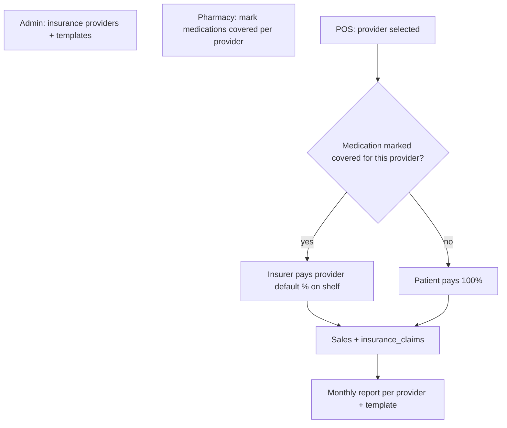

# Insurance implementation plan (simplified Rwanda flow)

Provider-level default coverage %, pharmacy marks which **own medications** are insurance-eligible per provider, POS uses that flag only, and monthly insurer invoices use admin-designed templates.

**Out of scope:** `insurance_formulary` table (removed from design), RSSB/RHIA master catalog, pharmacy-to-insurer mapping tables, live insurer APIs, mandatory per-drug tariff prices.

---

## Business model (target)



| Layer | Who | Responsibility |
|-------|-----|----------------|
| Providers | Platform admin | RSSB, MMI, etc.; default %; active/inactive |
| Templates | Platform admin | Per-insurer invoice layout (`insurance_templates`) |
| Insurance medicines | Pharmacy | Mark **own** `medications` as covered for each provider (external insurer PDF as reference only) |
| POS | Pharmacy staff | Listed + covered → provider %; else 100% patient |
| Month-end | Pharmacy | Report from real sales/claims; manual submit to insurer |

---

## Storage model (no formulary table)

**Do not use** `insurance_formulary`.

Pharmacy insurance eligibility lives on the medication record:

| Approach | Description |
|----------|-------------|
| **Preferred (minimal schema)** | `medications.insurance_coverage` `jsonb` — keys = `insurance_provider_id`, values = `{ "covered": true, "externalCode": "...", "notes": "...", "effectiveFrom": "...", "effectiveTo": "..." }` |
| **Alternative** | Slim junction `insurance_covered_medications` (same fields, no “formulary” naming) — only if JSON on `medications` becomes too heavy |

Rules:

- No separate insurer master list table.
- No per-drug coverage % in DB — **provider `default_coverage_percent` only**.
- No required tariff / `insured_unit_price`.
- Pharmacy UI toggles coverage per provider on each medication (search/list inventory catalog).

**Implemented:** `medications.insurance_coverage`, `coverage-engine.ts`, `/api/pharmacy/insurance-covered-medications`, `/pharmacy/insurance/medicines`. `insurance_formulary` table removed.

---

## What we keep

| Piece | Keep |
|-------|------|
| `insurance_providers` | Yes |
| `insurance_claims` + `insurance_claim_lines` | Yes |
| `insurance_templates` | Yes |
| Coverage preview + POS flow | Yes (after engine refactor off formulary) |
| `POST /api/pos/sale` server-side totals | Yes |
| Admin provider create + template designer | Yes |
| Admin guide | Yes |
| `pos.insurance` entitlement | Yes |

| Piece | Drop / refactor |
|-------|-----------------|
| `insurance_formulary` table | **Remove from design**; migrate away in code |
| `/admin/insurance/formulary` bulk import | **Remove** (replace with pharmacy medication UI or optional CSV on medications) |
| `no_tariff` fallback | **Remove** — unmarked = 100% patient |
| Admin formulary JSON import | **Remove** |

---

## Small adjustments

| Item | Change |
|------|--------|
| **Coverage engine** | Load eligibility from `medications.insurance_coverage[providerId]` (or junction); if missing or `covered: false` → insurer 0%; if covered → provider default % on shelf |
| **Provider %** | Sync `default_coverage_percent` on admin create/update |
| **Provider admin** | PATCH: `is_active`, default %, contacts |
| **POS** | Preview only; drop legacy `insurancePricing` when safe |
| **Claim lines** | Snapshot `externalCode` from medication JSON at sale time (for monthly report) |

**Minimal schema change:**

```sql
-- Preferred: one column on existing medications table
ALTER TABLE medications
  ADD COLUMN IF NOT EXISTS insurance_coverage jsonb NOT NULL DEFAULT '{}'::jsonb;
```

Optional later: drop `insurance_formulary` table after data migration script (not required day one if table empty).

---

## What is missing

| Requirement | Gap |
|-------------|-----|
| `medications.insurance_coverage` column | Not in migrations yet |
| Engine reads medication flags | Done |
| Pharmacy UI to mark meds per provider | `/pharmacy/insurance/medicines` |
| Provider edit/deactivate | `PATCH /api/insurance/[id]` + admin providers table |
| POS claim lines + external code | On sale + process; `external_code` on claim lines |
| Monthly report | `/api/reports/insurance-claims` + Reports → Insurance claims |
| Template designer → real invoice | Wired for monthly print (provider-specific template) |

---

## Invoice template designer vs monthly invoices

**Monthly print:** Selecting an insurer on the insurance claims report loads `insurance_templates` by provider name and renders HTML for print. Default layout is used when no template exists.

---

## Phase-by-phase plan

### Phase 1 — Coverage rules + medication flags (schema + engine)

1. Add `medications.insurance_coverage` jsonb (or agreed junction table).
2. Refactor `computeInsuranceCoverage` to read medication + provider id (no formulary query).
3. Not marked / not covered → patient 100%; marked + covered → provider default % on shelf.
4. Update POS line reasons: `covered`, `not_covered`, `not_listed`.

**Files:** new migration, `coverage-engine.ts`, `types.ts`, remove formulary usage from preview/process/sale paths.

---

### Phase 2 — Provider admin

- PATCH provider, list with active toggle, default %.
- **Files:** `api/insurance/[id]`, admin panel.

---

### Phase 3 — Pharmacy insurance medicines UI

- Settings or `/pharmacy/insurance/medicines`: pick provider → list pharmacy medications → toggle covered, optional external code/notes.
- API: update `medications.insurance_coverage` for session pharmacy.
- Remove redirect to admin formulary pages; remove admin formulary nav item when ready.

**Files:** new pharmacy page; `api/pharmacy/medications/...` or extend medications API.

---

### Phase 4 — Monthly report + template render

- Real `GET /api/reports/insurance-claims` from sales/claims.
- Pick `insurance_templates` by provider name; render print/export.

---

### Phase 5 — Cleanup

- Drop `insurance_formulary` table migration (new migration) if unused.
- Remove `formulary-import.ts`, `formulary/route.ts`, admin formulary panel, docs rename.
- Deprecate `/api/insurance/pricing` mock paths.

---

## Files involved (refactor map)

| Remove / replace | Keep |
|------------------|------|
| `supabase/migrations/20260529140000_insurance_formulary.sql` (deprecate) | `insurance_providers` |
| `src/lib/insurance/formulary-import.ts` | `coverage-engine.ts` (rewrite) |
| `src/app/api/insurance/formulary/route.ts` | `api/insurance/coverage/preview` |
| `admin-insurance-formulary-panel.tsx`, `admin/insurance/formulary` | `admin/insurance-templates` |
| `docs/insurance-formulary.md` → see `insurance-covered-medicines.md` | `insurance_claims`, POS UI |

---

## URLs (target)

| Role | URL |
|------|-----|
| Admin providers + templates | `/admin/insurance-templates` |
| ~~Admin formulary import~~ | **Removed** |
| Pharmacy insurance medicines | `/pharmacy/insurance/medicines` |
| Pharmacy POS | `/pharmacy/pos` |

---

## Avoiding overbuild

| Skip | Do |
|------|-----|
| `insurance_formulary` | Medication-level `insurance_coverage` JSON |
| RSSB catalog table | Pharmacy marks own meds |
| Per-drug % / tariff | Provider default % only |
| Live insurer API | Manual monthly submit |

---

## Related docs

- [Insurance-covered medicines](./insurance-covered-medicines.md)
- [Insurance module](./modules/insurance.md)
