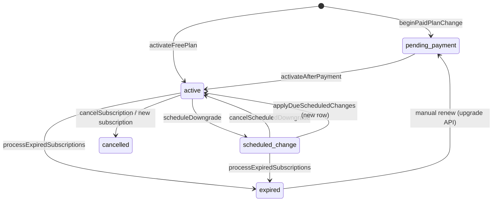
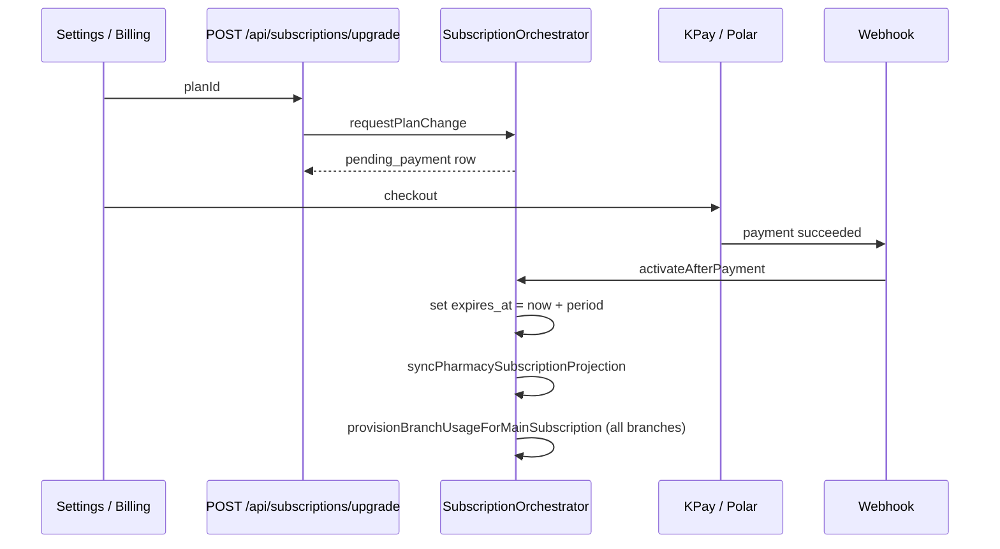

# Subscription lifecycle architecture

Pryrox uses a **single authoritative lifecycle** for main pharmacy subscriptions. All writes go through `SubscriptionOrchestrator` (`src/lib/subscription/orchestrator.ts`). Reads for access and limits go through `resolvePharmacyEntitlements` (`src/lib/subscription/lifecycle/entitlements.ts`).

Manual renewals and one-off checkouts remain; there is **no** auto-rebill or proration yet.

## Source of truth

| Layer | Role |
|--------|------|
| `subscriptions.status` | **Canonical** lifecycle state |
| `subscriptions.is_active` | **Derived** on write (`deriveIsActive`) — do not use alone for gates |
| `pharmacies.subscription_plan` | **Cache** — synced by `syncPharmacySubscriptionProjection` |
| `pharmacies.subscription_expires_at` | **Cache** — same projection |

## Lifecycle states

| Status | Access until `expires_at`? | Meaning |
|--------|----------------------------|---------|
| `pending_payment` | No | Paid plan chosen; awaiting KPay/Polar checkout |
| `active` | Yes | Current paid or free period |
| `scheduled_change` | Yes | Downgrade scheduled; **effective plan** stays current until expiry |
| `cancelled` | No | Ended or superseded |
| `expired` | No | Past `expires_at` (cron) |
| `past_due` | Reserved | Future use |

Legacy `pending` + `payment_method=pending` normalizes to `pending_payment` on read.

## State machine (main subscription)



### Rules

- **Paid activation** only via `activateAfterPayment` after webhook/payment confirmation.
- **`expires_at`** is set at **payment time** (or free activation time), not when the pending row is created.
- **Downgrades** use `next_plan_id` + `change_scheduled_at`; entitlements keep the **current** plan until apply.
- **Upgrades** clear any scheduled downgrade before creating pending or active rows.

## Write paths (orchestrator)

| Operation | Method |
|-----------|--------|
| Start paid checkout | `beginPaidPlanChange` |
| Free plan now | `activateFreePlan` |
| Settings/SaaS unified entry | `requestPlanChange` |
| Payment success | `activateAfterPayment` (+ branch usage provisioning for main plans) |
| Schedule downgrade | `scheduleDowngrade` |
| Cancel scheduled downgrade | `cancelScheduledDowngrade` |
| Apply due downgrades | `applyDueScheduledChanges` |
| Mark expired | `processExpiredSubscriptions` |
| Cancel | `cancelSubscription` |

Thin legacy modules (`create-pending-upgrade.ts`, `activate-subscription.ts`, etc.) delegate to the orchestrator.

## Entitlement resolution

`resolvePharmacyEntitlements(pharmacyId)` returns:

- `effectivePlan` — current catalog plan (ignores `next_plan_id`)
- `isAccessAllowed` — `status` grants access **and** `expires_at` in the future
- `scheduledChange` — target plan + `effectiveAt` when downgrade is scheduled

Used by: dashboard layout, `subscription-check`, `plan-limits`, `effective-plan`, SaaS `getPharmacyMainSubscription`.

## Payment activation flow



## Webhooks

| Route | Action |
|-------|--------|
| `POST /api/kpay/webhook` | `activatePaidSubscription` → `activateAfterPayment` |
| `GET /api/kpay/status` | Same when payment confirmed |
| Polar fulfillment | Same |

## Cron

`GET /api/cron/subscription-transitions` (external cron e.g. cron-job.org, `CRON_SECRET`):

1. `applyDueScheduledChanges` — rows with `pending_change_status=scheduled` and `change_scheduled_at <= now`
2. `processExpiredSubscriptions` — `active` / `scheduled_change` past `expires_at`

## SaaS billing API

`POST /api/saas/subscribe` with `subscription_type=main`:

- **Paid plan** → `beginPaidPlanChange` → `pending_payment` (no immediate access)
- **Free plan** → `activateFreePlan`
- **Branch addon** → still uses branch insert path in `subscription-engine` (separate from main lifecycle)

## Scheduled downgrade fields

| Column | Purpose |
|--------|---------|
| `next_plan_id` | Target plan at renewal |
| `change_scheduled_at` | Usually current `expires_at` |
| `change_type` | `downgrade` |
| `pending_change_status` | `scheduled` → `applied` / cleared |

Events logged in `subscription_change_events`.

## Database migration

`20250626100000_subscription_lifecycle_status.sql` extends `subscriptions.status` CHECK and backfills legacy rows.

Apply with:

```bash
npx supabase db push --include-all
```

## Catalog `plan_type` (database)

Each row in `subscription_plans` must have:

| `plan_type` | Examples | Shown in Settings |
|-------------|----------|-------------------|
| `main` | Standard, Premium, Starter | Main subscription plans |
| `branch_addon` | Branch Add-on | Branch add-ons only |

If a main-tier name (e.g. **Standard**) is stored as `branch_addon`, it will incorrectly appear under branch add-ons. Fix in Supabase:

```sql
SELECT id, name, price, plan_type, is_active
FROM subscription_plans
WHERE is_active = true
ORDER BY plan_type, name;
```

Migration `20250627120000_fix_subscription_plan_types.sql` corrects common mis-typed rows. Dedupe logic groups by **name + plan_type** (not name alone).

## Branch add-ons (UI flow)

When included main-plan branch slots are full:

1. **Branches** → “Add branch (add-on)” or **Billing** → **Branch add-ons** tab
2. Choose an add-on plan (catalog `plan_type = branch_addon`)
3. Enter new branch details
4. `POST /api/subscriptions/branch-addon` creates branch + `pending_payment` subscription
5. KPay / Polar checkout → `activateAfterPayment` → provisions that branch’s `branch_usage`

Capacity: `total_slots = main_plan.max_branches + active/pending add-on subscriptions`.

## Out of scope (v1)

- Proration
- Recurring card rebilling
- Stripe-style subscription schedules
- Auto-renew without manual checkout
